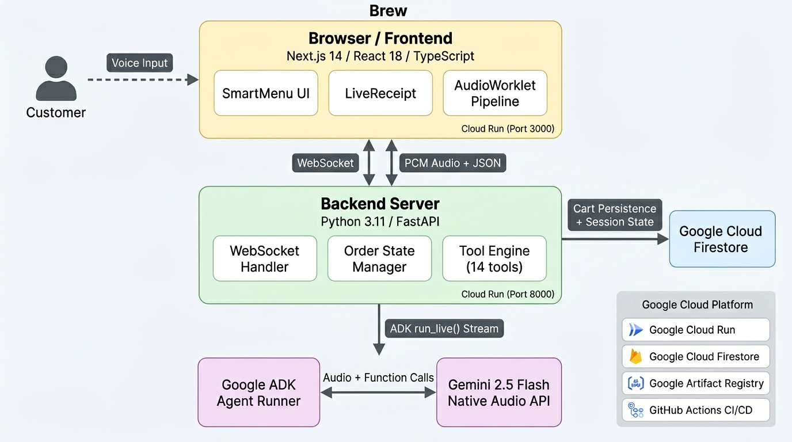

<p align="center">
  <h1 align="center">☕ Brew</h1>
  <p align="center"><strong>AI-Powered Voice Drive-Thru Ordering System</strong></p>
  <p align="center">Talk to our AI barista. Order with your voice. See your order come alive on screen.</p>
</p>

---

## 🎯 What is Brew?

Brew is a **real-time, voice-first AI ordering system** for coffee shop drive-thrus. Instead of waiting in line to speak with a human barista, customers interact with a conversational AI agent that takes their order through natural speech — just like talking to a real person.

The AI listens, understands, and processes orders in real time — dynamically updating the on-screen menu and receipt as the conversation flows. No buttons. No typing. Just talk.

### 🎥 Demo

> _Drive up → Talk to the AI → See your order build in real time → Pull up to the window!_

---

## ✨ Features

### 🗣️ Voice-First Ordering
- **Natural conversation** — Order drinks and food by speaking naturally, just like at a real drive-thru
- **Gemini Native Audio** — Uses Google's Gemini Live API with native audio processing for ultra-low-latency, natural-sounding voice interactions
- **Bidirectional streaming** — Simultaneous listen-and-speak with real-time interruption support

### 📋 Smart Dynamic Menu
- **3 menu categories** with 22 items: Drinks (12), Breakfast (5), Desserts (5)
- **Auto-switching tabs** — Menu automatically switches to the relevant category when you order (e.g., ordering a "Cake Pop" switches to Desserts)
- **Rich item cards** — Each menu item has a custom-generated image, name, and price

### 🧾 Live Order Receipt
- **Real-time "Your Order" panel** — Items appear instantly as the AI confirms them
- **Modifiers & customizations** — See syrups, milk swaps, toppings, ice levels, and warming options reflected live
- **Running total** — Price updates dynamically with each addition

### 🧠 Intelligent AI Barista
- **Context-aware** — Understands "make that iced instead", "actually, remove the last one", "add oat milk"
- **Modifier detection** — Parses intent like "I'm vegan" → auto-swaps to oat milk
- **Order management** — Add, remove, modify, undo, and clear with natural language
- **Upselling & suggestions** — Asks about warming for food items, whipped cream for mochas, size preferences

### 🔧 Robust Backend
- **10 tools** available to the AI: `add_item`, `remove_item`, `add_modifier`, `remove_modifier`, `set_modifier`, `set_ice_level`, `undo_last_change`, `clear_order`, `set_menu_view`, `get_order_summary`
- **Duplicate prevention** — Idempotent modifier operations prevent the AI from adding the same modifier twice
- **Session persistence** — Order state preserved across page refreshes via localStorage

---

## 🏗️ Architecture

<p align="center">
  
</p>

---

## 🛠️ Tech Stack

| Layer | Technology | Purpose |
|-------|-----------|---------|
| **AI Model** | Gemini 2.5 Flash (Native Audio Preview) | Real-time voice conversation with tool calling |
| **AI Framework** | Google Agent Development Kit (ADK) | Agent orchestration, tool management, live streaming |
| **Backend** | Python 3.11, FastAPI | WebSocket server, session management, order state |
| **Frontend** | Next.js 14, React 18, TypeScript | Dynamic UI with real-time state updates |
| **Audio** | Web Audio API (AudioWorklet) | Low-latency audio capture and playback in browser |
| **Transport** | WebSockets | Bidirectional real-time communication |
| **Containerization** | Docker, Docker Compose | One-command reproducible deployment |

---

## 🚀 Quick Start

### Prerequisites

- **Docker** and **Docker Compose** installed ([Get Docker](https://docs.docker.com/get-docker/))
- A **Google API Key** from [Google AI Studio](https://aistudio.google.com/apikey)

### 1. Clone the Repository

```bash
git clone https://github.com/thilak15/Brew.git
cd Brew
```

### 2. Set Up Environment Variables

```bash
cp backend/.env.example backend/.env
```

Open `backend/.env` and add your API key:

```env
GOOGLE_GENAI_USE_VERTEXAI=FALSE
GOOGLE_API_KEY=your_api_key_here
```

### 3. Build & Run

```bash
docker compose up -d --build
```

This builds and starts both containers:
- **Frontend**: http://localhost:3000
- **Backend**: http://localhost:8000

### 4. Start Ordering!

1. Open http://localhost:3000 in your browser (Chrome recommended for best audio support)
2. Click the **"Drive Up"** button to start a new session
3. **Allow microphone access** when prompted
4. Start speaking! Try: _"Hi, can I get a grande iced latte with oat milk?"_

### Stopping

```bash
docker compose down
```

<details>
<summary><strong>🔧 Manual Local Setup (without Docker)</strong></summary>

### Backend

```bash
cd backend
python -m venv .venv
source .venv/bin/activate
pip install -r requirements.txt
cp .env.example .env
# Add your GOOGLE_API_KEY to .env
uvicorn main:app --host 0.0.0.0 --port 8000
```

### Frontend

```bash
cd frontend
npm install
echo "NEXT_PUBLIC_WS_URL=ws://localhost:8000" > .env.local
npm run dev
```

</details>

<details>
<summary><strong>☁️ Deploy to Google Cloud Run</strong></summary>

### Prerequisites

- [Google Cloud SDK](https://cloud.google.com/sdk/docs/install) installed
- A GCP project with billing enabled
- Your `GOOGLE_API_KEY` from [Google AI Studio](https://aistudio.google.com/apikey)

### 1. Set Up GCP

```bash
gcloud auth login
gcloud config set project YOUR_PROJECT_ID
gcloud services enable run.googleapis.com artifactregistry.googleapis.com
```

### 2. Create Artifact Registry

```bash
gcloud artifacts repositories create brew-repo \
  --repository-format=docker \
  --location=us-central1

gcloud auth configure-docker us-central1-docker.pkg.dev
```

### 3. Deploy Backend

```bash
# Build & push
docker build -t us-central1-docker.pkg.dev/YOUR_PROJECT_ID/brew-repo/brew-backend ./backend
docker push us-central1-docker.pkg.dev/YOUR_PROJECT_ID/brew-repo/brew-backend

# Deploy to Cloud Run
gcloud run deploy brew-backend \
  --image us-central1-docker.pkg.dev/YOUR_PROJECT_ID/brew-repo/brew-backend \
  --region us-central1 \
  --port 8000 \
  --allow-unauthenticated \
  --set-env-vars "GOOGLE_API_KEY=YOUR_API_KEY,GOOGLE_GENAI_USE_VERTEXAI=FALSE" \
  --memory 512Mi \
  --timeout 300 \
  --session-affinity
```

> Note the backend URL from the output (e.g., `https://brew-backend-xxxxx-uc.a.run.app`)

### 4. Deploy Frontend

```bash
# Build with the backend URL from Step 3
docker build \
  --build-arg NEXT_PUBLIC_WS_URL=wss://brew-backend-xxxxx-uc.a.run.app \
  -t us-central1-docker.pkg.dev/YOUR_PROJECT_ID/brew-repo/brew-frontend \
  ./frontend

docker push us-central1-docker.pkg.dev/YOUR_PROJECT_ID/brew-repo/brew-frontend

# Deploy to Cloud Run
gcloud run deploy brew-frontend \
  --image us-central1-docker.pkg.dev/YOUR_PROJECT_ID/brew-repo/brew-frontend \
  --region us-central1 \
  --port 3000 \
  --allow-unauthenticated \
  --memory 256Mi
```

### 5. Access Your App

Open the frontend URL from the deploy output (e.g., `https://brew-frontend-xxxxx-uc.a.run.app`).

> **Cost:** Cloud Run free tier includes 2M requests/month — a hackathon demo costs ~$0.

</details>

## 📁 Project Structure

```
Brew/
├── backend/
│   ├── main.py              # FastAPI WebSocket server + event pipeline
│   ├── agent.py             # Google ADK agent with 10 order tools
│   ├── order_state.py       # Per-session order state management
│   ├── menu.py              # Menu loader + system prompt builder
│   ├── menu.json            # Full menu: drinks, breakfast, desserts, modifiers
│   ├── system_prompt.md     # AI barista personality & behavior rules
│   ├── requirements.txt     # Python dependencies
│   ├── Dockerfile           # Backend container
│   └── .env.example         # Environment variable template
├── frontend/
│   ├── app/page.tsx         # Main page with session management
│   ├── components/
│   │   └── SmartMenu.tsx    # Dynamic tabbed menu with item cards
│   ├── lib/
│   │   ├── useBrewWebSocket.ts   # WebSocket hook for real-time communication
│   │   ├── audioPipeline.ts      # AudioWorklet-based capture + playback
│   │   └── orderReducer.ts       # State management for orders
│   ├── public/
│   │   ├── audio-processor.js    # AudioWorklet processor
│   │   └── images/menu/          # AI-generated menu item images
│   └── Dockerfile           # Frontend container
├── docker-compose.yml       # One-command orchestration
└── README.md
```

---

## 🗂️ Menu

| Category | Items |
|----------|-------|
| **Drinks** (12) | Iced Latte, Hot Latte, Caramel Macchiato, Mocha, Chai Latte, Matcha Latte, Cold Brew, Americano, Espresso, Frappuccino, Brewed Coffee, Hot Chocolate |
| **Breakfast** (5) | Bacon & Gouda Sandwich, Spinach Feta Wrap, Ham & Swiss Croissant, Egg Bites, Butter Croissant |
| **Desserts** (5) | Chocolate Chip Cookie, Fudge Brownie, Blueberry Muffin, Lemon Loaf, Cake Pop |
| **Modifiers** | Syrups (Vanilla, Caramel, SF Vanilla, Hazelnut, Mocha), Milk Swaps (Oat, Almond, Soy, Whole, Nonfat), Toppings (Whipped Cream, Cold Foam, Matcha Cold Foam, Caramel Drizzle, Cinnamon), Ice Levels (Light, Normal, Extra, No Ice), Warming |

---

## 🔑 Environment Variables

| Variable | Required | Description |
|----------|----------|-------------|
| `GOOGLE_API_KEY` | ✅ | API key from [Google AI Studio](https://aistudio.google.com/apikey) |
| `GOOGLE_GENAI_USE_VERTEXAI` | ✅ | Set to `FALSE` (uses AI Studio, not Vertex) |
| `BREW_AGENT_MODEL` | ❌ | Override AI model (default: `gemini-2.5-flash-native-audio-preview-12-2025`) |


## 📝 License

This project is licensed under the [MIT License](LICENSE).
